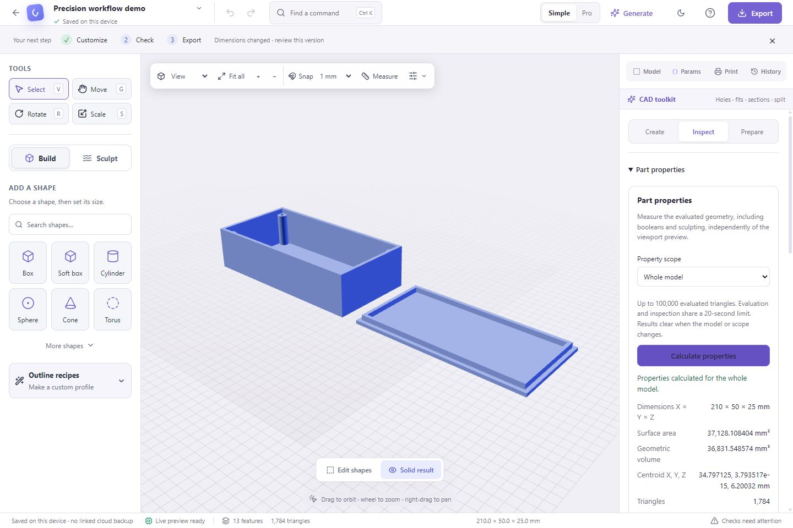
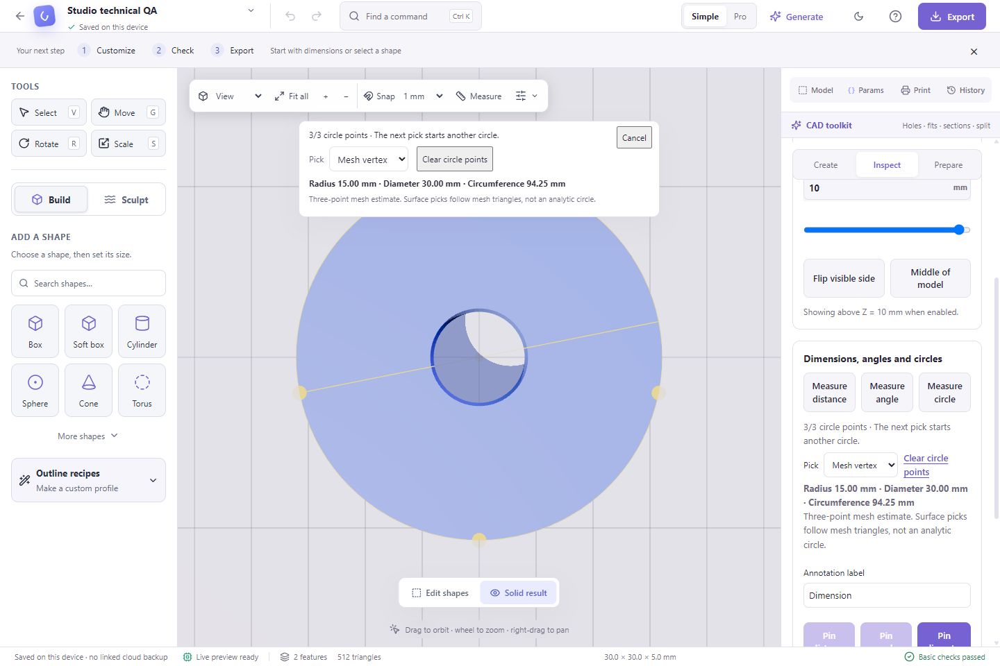
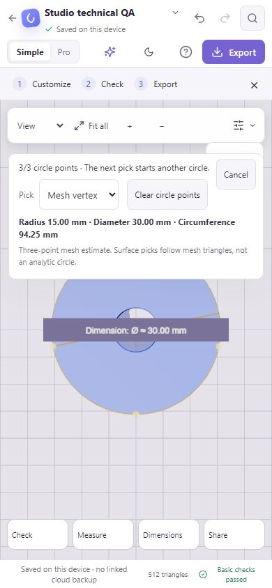
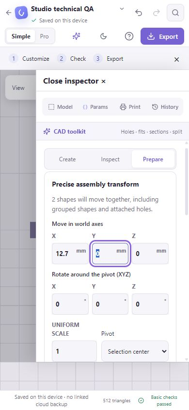
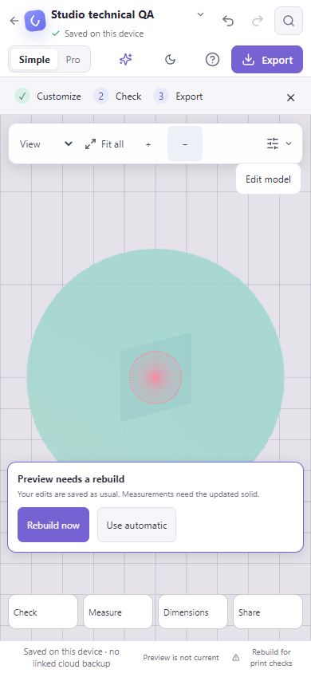
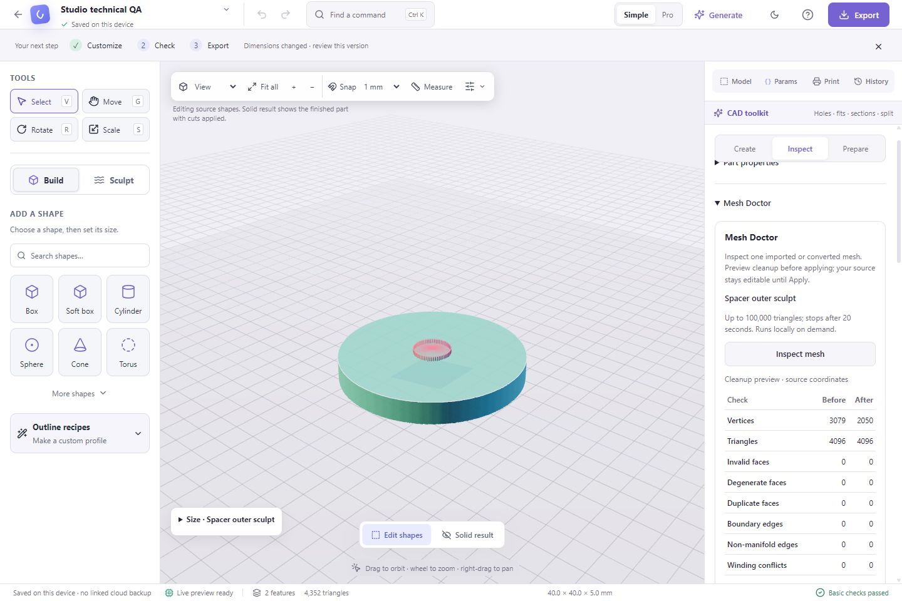
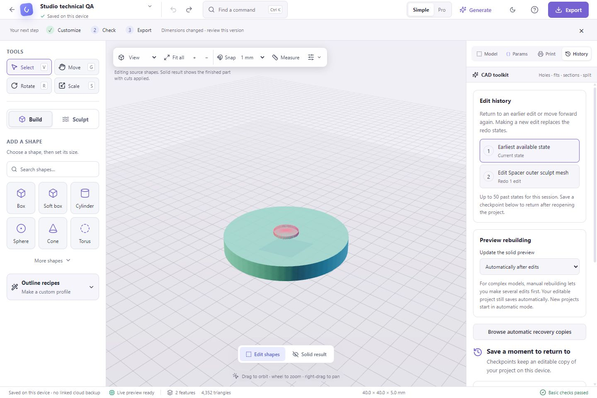

# Studio technical workflow research — October 4, 2026

## Brief and scope

Help beginners and intermediate makers inspect imported parts, measure and position them precisely, recover from edits, and keep complex projects responsive. Extend the current React/Three.js/Manifold studio and preserve editable projects. The user authorizes implementation of all six priorities, feature branches, GitHub validation, PR merge, and public Sites publication.

This is source-level research and a current FormForge workflow audit, not a hands-on evaluation of every comparator. No external source code is copied or new CAD kernel embedded.

## Repository analysis

| Repository / inspected source | Finding | FormForge decision |
| --- | --- | --- |
| [FreeCAD mesh evaluation](https://github.com/FreeCAD/FreeCAD/blob/e104a127e02de8c0b329b088ad7aaa2cfbccd69d/src/Mod/Mesh/Gui/DlgEvaluateMeshImp.cpp) | Separates mesh analysis from specific repair operations. | Offer an explicit inspection and a preview before safe cleanup. Do not promise arbitrary hole filling or self-intersection repair. |
| [FreeCAD diameter measurement](https://github.com/FreeCAD/FreeCAD/blob/e104a127e02de8c0b329b088ad7aaa2cfbccd69d/src/Mod/Measure/App/MeasureDiameter.cpp) | Uses analytic shape information for diameter. | Our tessellated meshes need a clearly labelled three-point circle estimate; it is not analytic face recognition. |
| [JSCAD volume](https://github.com/jscad/OpenJSCAD.org/blob/f245ea3a5072024b789f276c6fb9ce6c3eb3fd0d/packages/modeling/src/measurements/measureVolume.js) and [center of mass](https://github.com/jscad/OpenJSCAD.org/blob/f245ea3a5072024b789f276c6fb9ce6c3eb3fd0d/packages/modeling/src/measurements/measureCenterOfMass.js) | Computes geometric properties from oriented geometry and reuses immutable results. | Evaluate exact export scope in an isolated worker, then calculate mesh properties. State uniform-density assumptions; omit volume/centroid when topology is unsuitable. |
| [GridSpace mesh tools](https://github.com/GridSpace/grid-apps/blob/d138275bbe9d4e4030d8cb8b2dcf66607da9295a/src/mesh/tool.js) | Normalizes vertices, filters duplicate faces and works with face adjacency. | Bounded cleanup with detailed counts and attribute preservation; keep original source until Apply. |
| [SolveSpace undo/redo](https://github.com/solvespace/solvespace/blob/581f4cbf5617bf32ba5856e93ee06a25842128fd/src/undoredo.cpp) | Maintains bounded snapshots, clearing redo after a new branch of edits. | Expose the existing bounded session stack as labelled states, with atomic multi-step undo/redo. |
| [JSketcher history UI](https://github.com/xibyte/jsketcher/blob/c1905c4f9df9711206866c8b39e982f52d598d88/web/app/cad/craft/ui/HistoryTimeline.jsx) and [circle action](https://github.com/xibyte/jsketcher/blob/c1905c4f9df9711206866c8b39e982f52d598d88/web/app/sketcher/actions/measureActions.js) | Makes history position/rebuild explicit and exposes circle dimensions as a task. | Discoverable session recovery, circle measurement, and a manual rebuild option. FormForge session history is not parametric feature rollback. |

Repository metadata reports FreeCAD LGPL-2.1, SolveSpace GPL-3.0, JSCAD/GridSpace MIT. JSketcher has a custom license with contribution conditions; it is a conceptual reference only. No repository is vendored, executed, or added as a dependency.

## Priorities — implement all

1. **Mesh Doctor.** Analyze one imported mesh off the main thread, up to 100,000 triangles with a 20-second timeout and cancellation. Explain duplicate/degenerate faces, boundary/non-manifold edges and winding conflicts. Preview welded/cleaned geometry and before/after counts; apply only to the same unlocked source snapshot. Preserve sculpt masks conservatively when welding. Cleanup must not claim to fill holes, resolve self-intersections, or infer cavity orientation. Fix false watertight claims for inconsistent winding.
2. **Evaluated part properties.** Whole model or selected complete groups; dimensions, area, volume and uniform-density centroid from the evaluated result. Respect existing scope rules and global-sculpt limitations. Cancel/clear results on geometry or scope changes; provide a downloadable report. Empty, invalid, open or inconsistently oriented surfaces cannot produce a trusted solid-volume result.
3. **Three-point circle measurement.** Radius/diameter/circumference from three surface or mesh-vertex picks. Reject coincident/near-collinear points, show pick progress, and support pinned diameter annotations with existing stale-geometry behavior. Preserve old distance/angle annotations and distinguish sampled approximation from analytic circles.
4. **Precise assembly transforms.** Draft translation, rotation and uniform scaling with selection-center, active-origin or world-origin pivot. Include complete assemblies/cutters, respect locks and existing volume-sculpt limitations. Apply once as one undo step; cancel/draft changes do not alter geometry. Use existing arithmetic/unit inputs and detach transform bindings only where transforms change.
5. **Visible session history.** Label changes inferred from existing immutable snapshots, show current/past/redo states, and jump via atomic undo/redo. Preserve forward states until a new edit; do not create dozens of builds/saves on a jump. Reset selection/placement correctly. Explain that session history is not persisted; checkpoints remain the durable recovery feature.
6. **On-demand rebuilding.** Automatic remains the default. Manual mode cancels queued/active preview builds, still autosaves edits, and clearly labels stale results. Rebuild now produces only the latest document; enabling automatic resumes it. Project replacement restores automatic mode. Preview-dependent checks must not present old geometry as current; export still evaluates its own captured snapshot.

## Current audit

1. **Open the studio:** healthy overall canvas/tool separation, but no way to batch expensive rebuilds. Screenshot `qa/studio-v9/01-studio-before.png`.
2. **Inspect a part:** section, distance and angle tools exist. There is no circle task or consolidated evaluated properties report. Screenshot `qa/studio-v9/02-inspect-before.png`; source confirms the gaps.
3. **Recover edits:** checkpoints are clearly explained, but there is no visible session-state list. Screenshot `qa/studio-v9/03-history-before.png`.

Source audit also found mesh cleanup drops the mask array and mesh watertight classification omits edge-orientation conflicts. These are code findings, not screenshot claims. The release must test keyboard access, phone reflow, invalid inputs, cancellation, stale snapshots, locks and undo. Physical printing, general BRep/STEP support and formal accessibility compliance are not established by this work.

## Implemented result and validation

All six priorities are implemented. Find Mesh Doctor, part properties and circle measurement in **CAD toolkit → Inspect**; precise assembly transforms in **Prepare**; edit history and preview rebuilding in **History**. Every feature is also discoverable in command search.

Additional fixes from verification:

- Source cleanup preserves welded vertex masks and retained face materials, and no longer runs automatically on the Print panel's main thread.
- Inconsistent edge winding and reversed external shells that touch at a vertex cannot produce trusted solid properties. Cavity orientation and translated coordinates have regressions.
- New volume-sculpt strokes cannot start on an outdated result; stamps within one valid gesture still work.
- Manual mode explicitly asks for a rebuild in both the canvas and print checks, while persistence continues.
- Secondary-button hover contrast and phone transform targets were corrected during visual review.
- Session labels distinguish mesh conversion and mesh edits from renaming.

Validation: `npm run check`, **498 unit tests** (46 model + 452 web), production build and entry-bundle budget passed. **26 browser scenarios** passed with retries disabled across desktop Chromium and Pixel 7 layouts. Independent review found two correctness issues; both were fixed with regression coverage and accepted in the follow-up review.

Hands-on browser evidence also verified a 30 mm washer measured as radius 15.00 mm / diameter 30.00 mm / circumference 94.25 mm, a saved diameter annotation, evaluated enclosure properties, a 4,096-triangle Mesh Doctor cleanup (3,079 to 2,050 vertices), one-step cleanup undo/redo, and phone transform/manual-rebuild layouts. Test fixture mistakes in the initial browser run were corrected before the clean 26-scenario run.

The GitHub push, PR and merged-main pipelines validate every committed release state. Publication uses the artifact downloaded from the successful exact merged-main run. Deployment IDs and live-byte checks are recorded in the local release ledger after publication.

## Visual evidence

## Deliberate boundaries

This release does not add STEP/BRep editing, a constraint solver, arbitrary hole filling, self-intersection repair, persistent parametric rollback or physical-print certification. These need separate architecture and acceptance work. Circle values are mesh estimates; centroid assumes uniform density. Analysis is limited to 100,000 triangles and 20 seconds, with volume withheld for unsuitable topology or more than 128 connected shells. Automated and visual checks are not a formal accessibility audit or evidence of physical print success.
