# FormForge usability pass — October 4, 2026

This pass found six concrete sources of friction in the existing product and implements all six. The most serious were overlapping mobile navigation and the normal Export action retaining a previously requested editable-backup format.

## Scope and evidence

The goal was to help a beginner or experienced maker find a project, reach the appropriate editing controls, discover tools, and choose the intended download without changing the CAD model or its storage behavior. Evidence was captured from the current public v7 site, then checked against the local implementation on the same day. Desktop and 390 × 844 layouts were inspected visually; automated navigation checks also cover 320, 590 and 768 pixel widths and desktop/phone browser configurations.

Screenshots are from this audit, saved and inspected before acceptance. Local and public browser storage contain different QA projects; the comparisons concern layout and behavior, not identical model thumbnails. The pass combines screenshots, accessibility trees, keyboard interactions, source inspection and automated journeys. It is not a full WCAG conformance assessment or observed-user usability study. Authenticated cloud collaboration and physical print quality were outside this pass.

## Required fixes and implemented result

| Priority | Issue and effect | Implemented fix | Evidence |
| --- | --- | --- | --- |
| P1 | Eight navigation labels overlap on a phone. Recovery, cloud and template destinations are hard to read or target. | My projects and Templates remain directly visible. More opens a labelled modal with every destination, readable 48px rows, Escape dismissal and focus return. Desktop navigation is retained. | Step 2; images 03, 10 and 11. |
| P1 | Open editable backup, close it, then select the main Export button: the format remains Editable backup. A user expecting a slicer file can receive JSON. | Each request sets its intent explicitly. Normal exports start at 3MF, backup requests start at editable backup, and closing resets transient export intent. Regression coverage checks both the main button and workflow events. | Step 5; image 08. |
| P2 | Separate-parts export is styled as a competing primary action above the normal format controls. Arrangement details consume the first screen, and Download file does not identify the output. | Scope and format lead; advanced tools live under More export options. The sticky primary action says Download 3MF, Download STL or Download editable backup and shows the actual filename. Slicer instructions are expandable. Direct arrangement commands open the disclosure with arrangement enabled. | Step 5; images 06 and 13. |
| P2 | Opening command search shows 75 commands, with unavailable sculpt operations dominating the first screen. Generic disabled copy incorrectly suggests selecting a shape could enable Undo. | Eight common actions appear first. Browse all and full search preserve access to every tool. All-command browsing puts usable actions first; disabled actions provide specific prerequisites and expose disabled state on the option. Keyboard search and Enter continue to work. | Step 4; images 07 and 12. |
| P2 | The phone Dimensions action opens a generic shape list for a plain model. Selection instructions refer only to holding Shift. | The label reflects the destination: Dimensions for template customization, Parameters for a model with named parameters, Model otherwise. Guidance names the visible Multi-select control. | Step 3; images 04 and 05. |
| P3 | The standalone template library jumps from its H1 to H3 card titles. Screen-reader heading navigation loses the expected level. | Template cards use H2 under the standalone library's H1, and H3 under the home page's H2 section. Typography is preserved. | Step 1; image 09 and DOM heading checks. |

## Journey review

1. **Find a template — healthy after the heading fix.** Search, category controls, result counts and an empty-search recovery action are present. The public phone navigation is readable. Physical-print evidence is explicitly marked pending.
2. **Find or resume a project — repaired on mobile.** Desktop hierarchy, project search and its Clear search recovery work. Phone navigation was unreadable; the replacement preserves the same destinations and collection controls. Project action menus remain reachable after scrolling.
3. **Inspect and edit — clearer phone destinations.** The studio separates the canvas from tools and inspector, with a phone review mode. The prior plain-model Dimensions label was misleading; the conditional label now matches the panel. Existing template customizers and geometry behavior remain intact.
4. **Find a tool — repaired discovery.** Useful actions now appear before the complete catalogue. Full search, no-result guidance, unavailable-action explanations, keyboard activation and Escape remain available.
5. **Export or back up — repaired intent and hierarchy.** The preview, scope and file format stay central. Main and backup actions produce distinct requests, advanced exports remain reachable, and a format-specific sticky download action remains visible on a phone.

## Captured evidence

### Before

Desktop studio and workshop retain a useful overall structure:

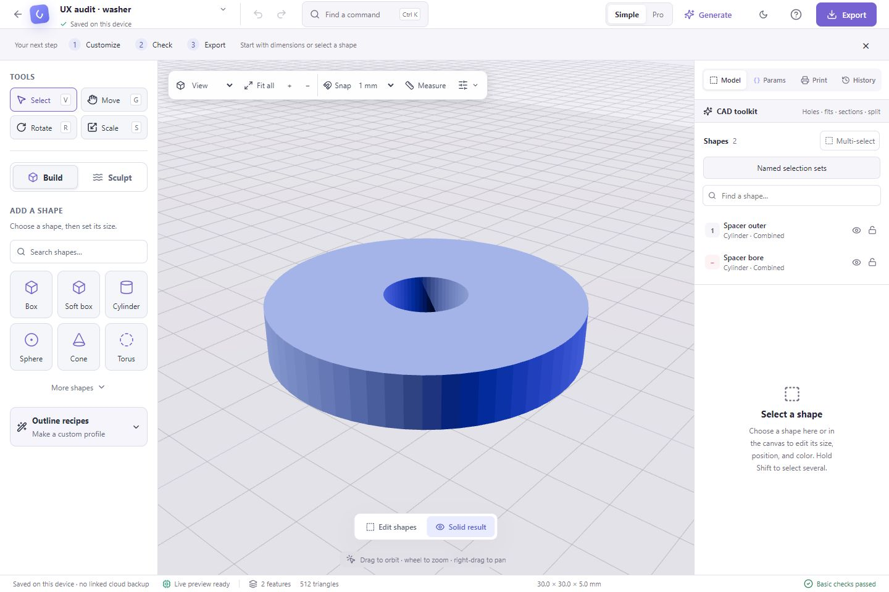
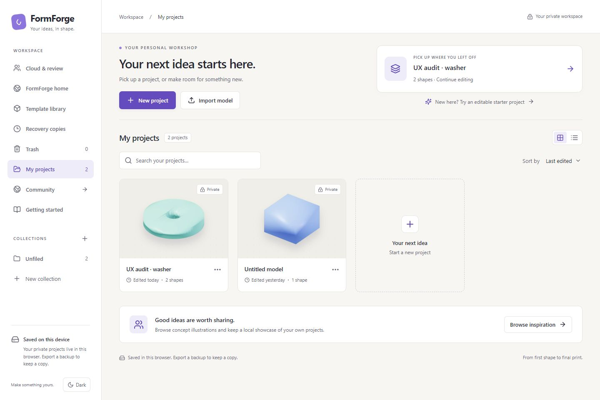

Phone navigation overlaps:

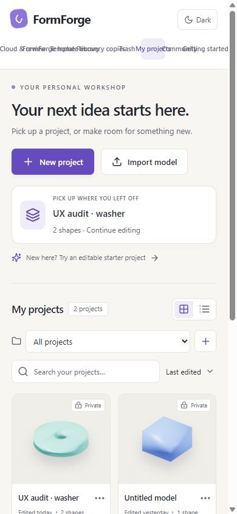

The phone Dimensions action on a plain model leads to general selection:

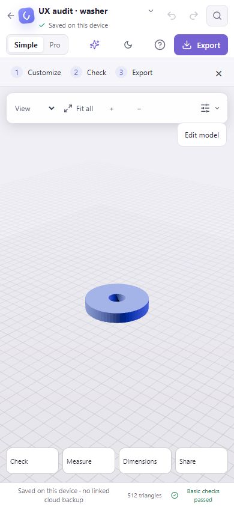
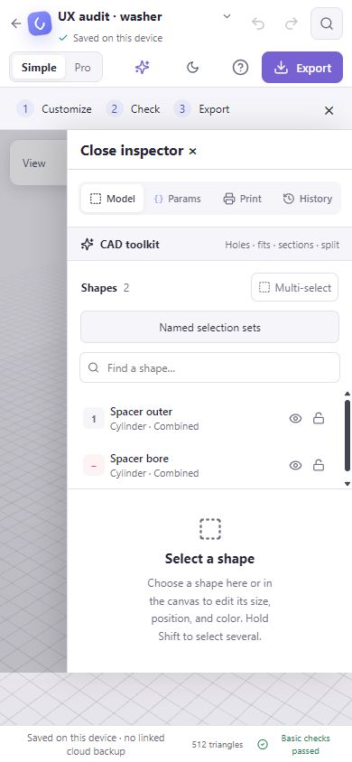

Export hierarchy and command overload:

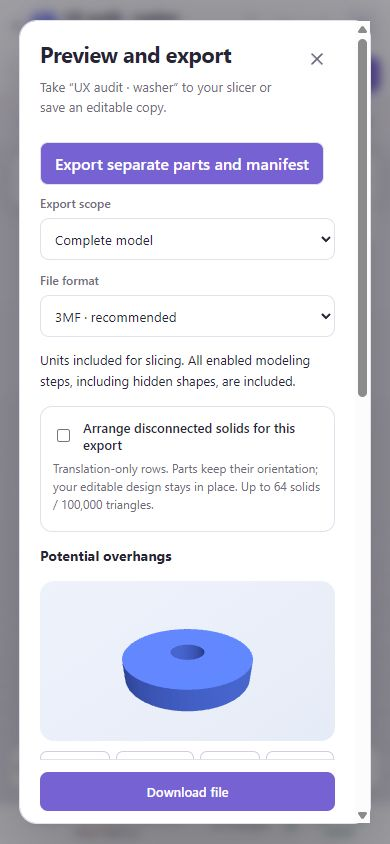
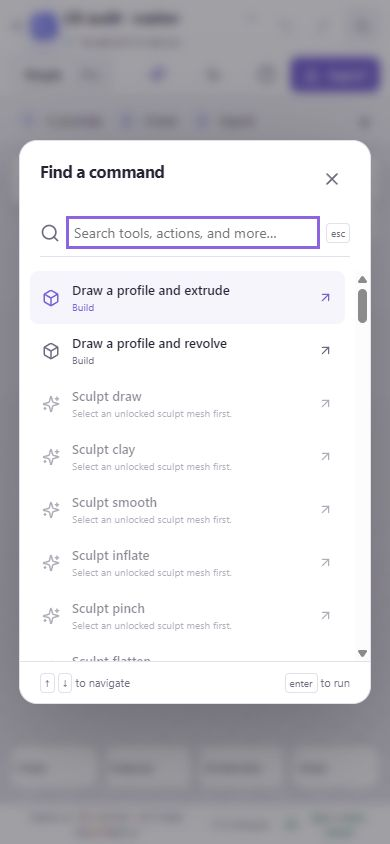

Normal Export incorrectly retains the backup format:

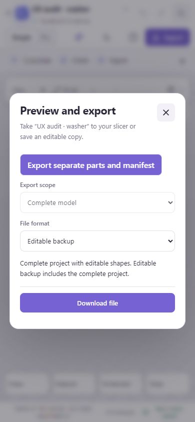

Template search has a usable visual layout; heading levels required a semantic fix:

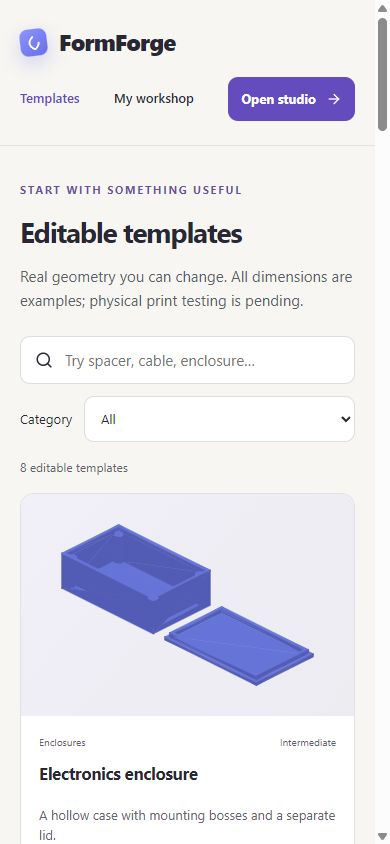

### After

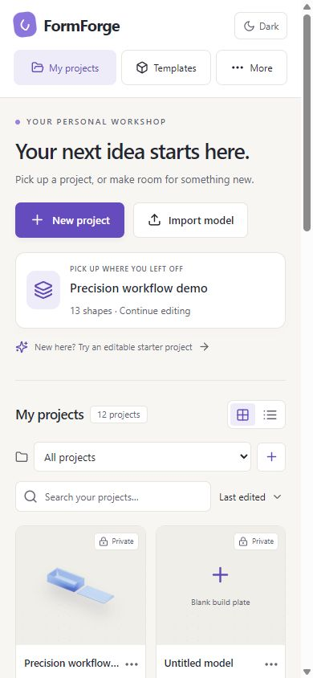
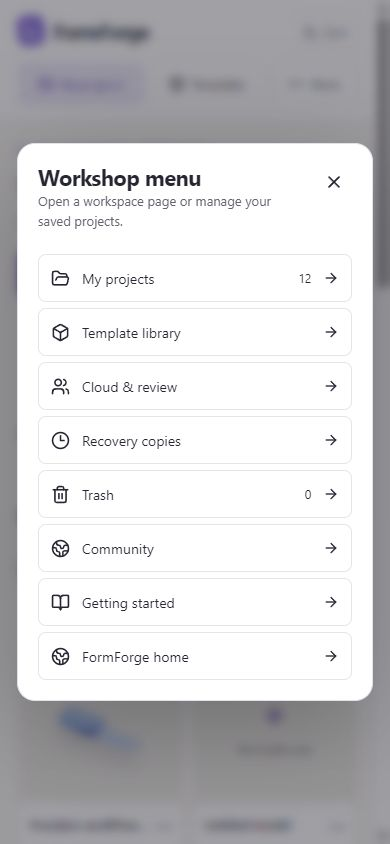
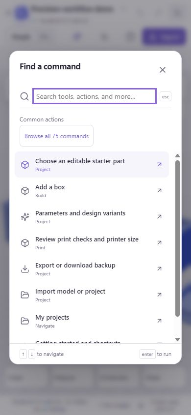
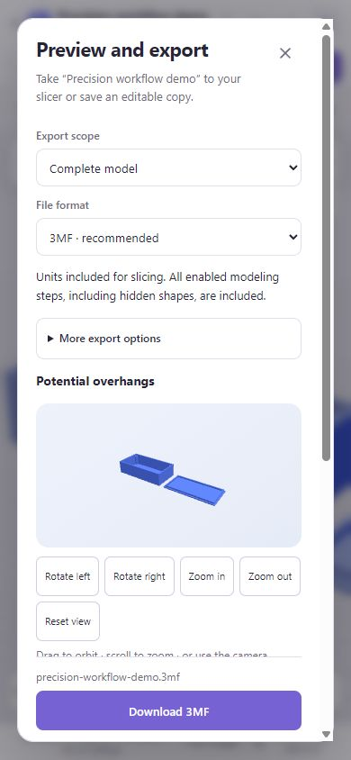
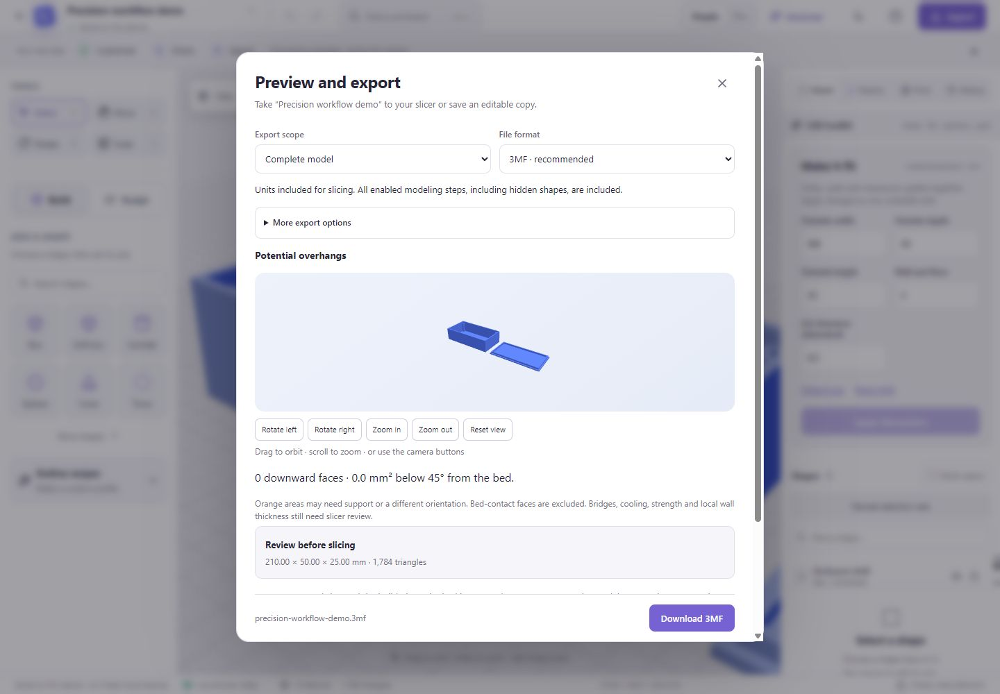

## Verification and release

The implementation adds no dependencies and preserves saved-model schemas. Unit tests cover export request intent, actual selected-geometry downloads, late-result cancellation, common commands, full search, unavailable actions and keyboard execution. Browser coverage includes navigation geometry, menu focus and recovery, heading levels, actual STL downloads, direct arrangement, phone labels and the previous CAD workflows.

Local validation passed 418 unit tests, TypeScript checks, the production build, the entry-bundle budget and whitespace checks. All 20 browser scenarios passed across the initial run and a focused rerun: the first run passed 18, and an overly broad test locator counted background dropdown options as commands in the remaining two. Scoping it to the Commands listbox resolved both; all six new scenarios passed on rerun without a product-code change. Independent read-only code review found no blockers. The release CI reruns the complete suite.

Release requires green feature-branch and PR CI, merge, green main CI, then publication of that exact main artifact. Live validation checks asset hashes and public routes. These checks establish the tested behavior; they do not establish a measured usability score.
